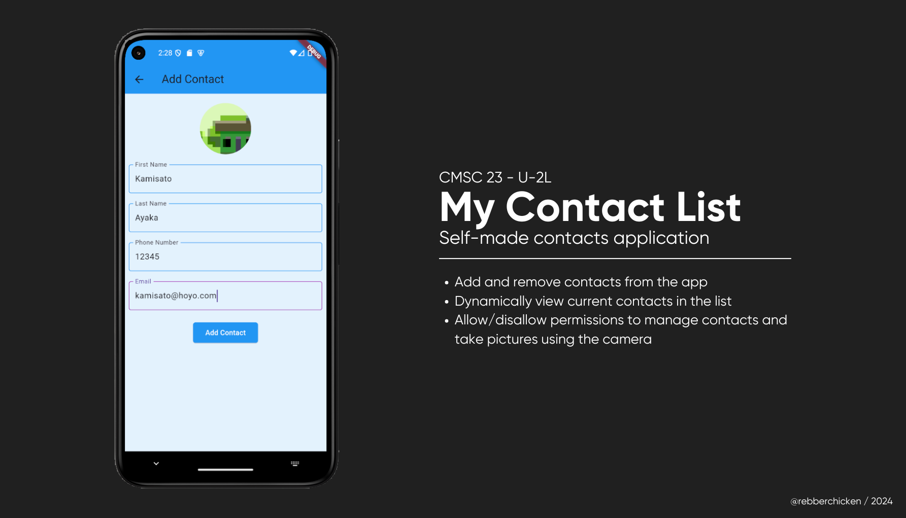

# Contact List w/ Android Features and Utilities

**Name:** Bernard Jezua R. Tandang  
**Section:** U-2L  
**Student number:** 2021 - 09992  

## Code Description

This flutter application allows the user to add and remove contacts dynamically. They can also add an image using their camera if they have allowed permission.

## Things you did in the code

1. **Light Blue Style**: Added style from Exercise 4, copied most of the slambook design from buttons to input decorations.
2. **Add & Delete Functionality**: Used `Form` to get the entries of the user's basic information. Also used `flutter_contacts` and `permission_handler` to manage contacts and to use the camera of the device.
3. **Error Handling**: Caught errors in the form that prompts if the user did not fill out any of the text fields.

## Challenges encountered

- There was only one challenge that I encountered, and that was not using `StatefulWidget` for showing the Image file since it requires a `Final` keyword. But after initializing it, it led to another problem that disallows me to `setState()`.
- I have set up most of the designs earlier in the `StatelessWidget` and it ate up most of my time, I remember I only had 45 minutes left, and somehow I managed to revamp this stateless widget to stateful.

## References

- Ayaz, M. (2021, February 14). The Easy Way to Add, Update and Delete contacts in Flutter. CodeWithAhsan; Muhammad Ahsan Ayaz. https://www.codewithahsan.dev/blog/the-most-easy-way-to-add-update-and-delete-contacts-in-flutter
- Itchybumr. (2021, February 17). Flutter tutorial— Image Picker — Picking photos from camera or photo gallery. Medium; Medium. https://itchybumr.medium.com/flutter-tutorial-image-picker-picking-photos-from-camera-or-photo-gallery-5243a5eff6b4
- pub.dev. (2020, November 24). Dart Packages. https://pub.dev/packages/flutter_contacts
